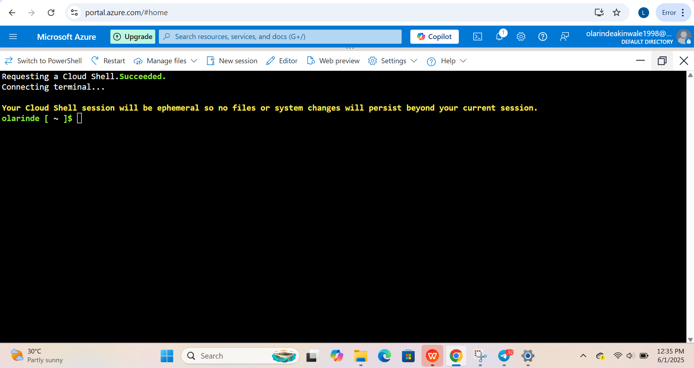
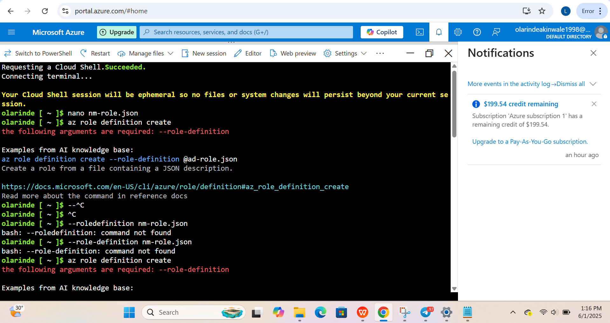

# 🔐 Azure Custom Role Creation + VM SSH Access (with Free Tier Limitation Handling)

This project demonstrates how to create a Custom Azure Role with limited permissions and assign it to a user using the Azure CLI. It includes all the necessary configuration, screenshots of the implementation steps, and real-world error handling — including what happens when your subscription is on the free tier.

---

## 🧠 Project Goal

Create a Custom Role named "VM Start Stop Reader Role" that allows:
- Starting/stopping a virtual machine
- Reading network interface & IP data
- Viewing subscription resource group details

Then assign that role to a user using the Azure CLI.

---
---

## 📦 Step-by-Step Implementation

### ✅ 1. Launch Cloud Shell
- Used Bash shell in Azure Cloud Shell  
- Verified shell loaded with olarinde [ ~ ]$

### ✅ 2. Create Custom Role JSON

Opened a new file using nano nm-role.json and pasted this:

`json
{
  "Name": "VM Start Stop Reader Role",
  "IsCustom": true,
  "Description": "Can start, stop VMs and read metrics/network",
  "Actions": [
    "Microsoft.Compute/virtualMachines/start/action",
    "Microsoft.Compute/virtualMachines/deallocate/action",
    "Microsoft.Compute/virtualMachines/read",
    "Microsoft.Network/networkInterfaces/read",
    "Microsoft.Network/publicIPAddresses/read",
    "Microsoft.Resources/subscriptions/resourceGroups/read",
    "Microsoft.Insights/metrics/read"
  ],
  "NotActions": [],
  "AssignableScopes": ["/subscriptions/<your-subscription-id>"]
}

### ✅ 3. Custom Role Creation (Output)

